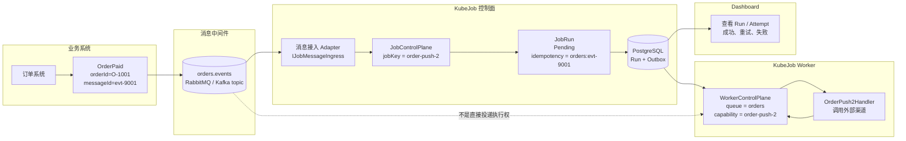
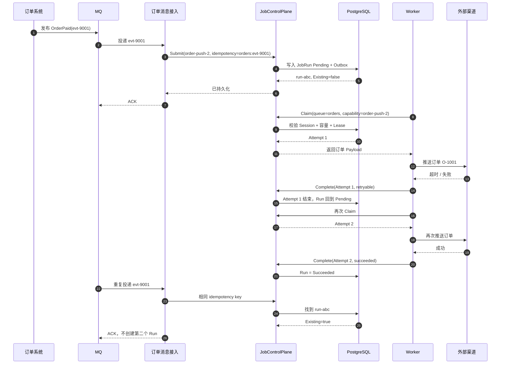
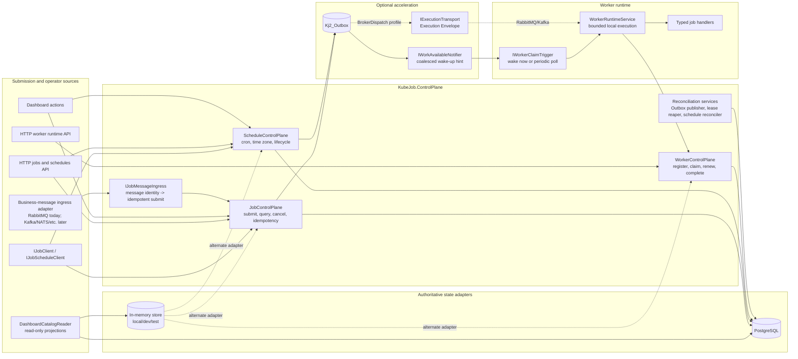
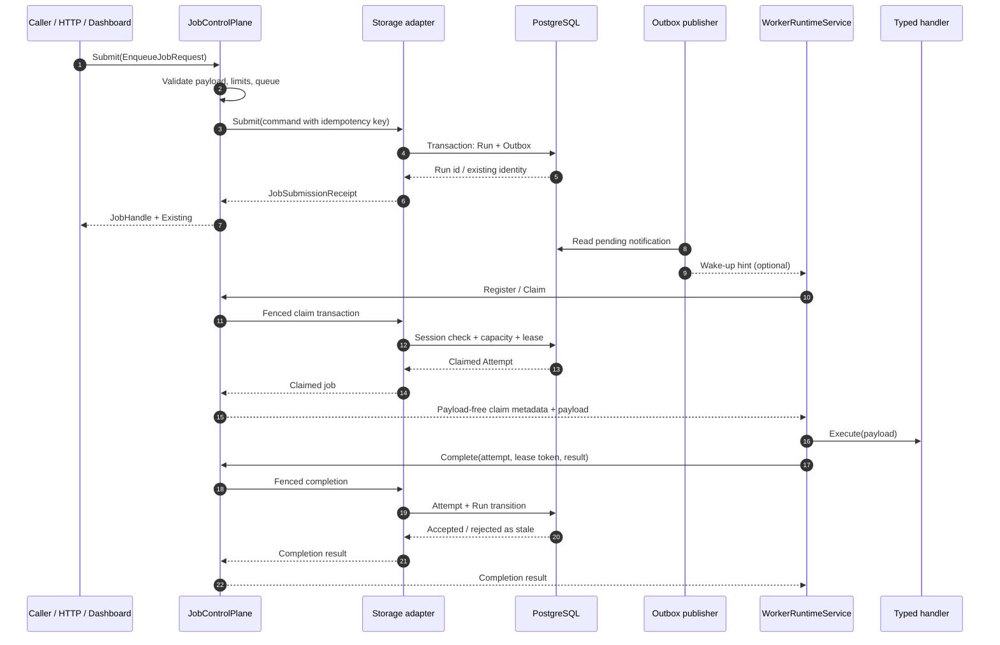
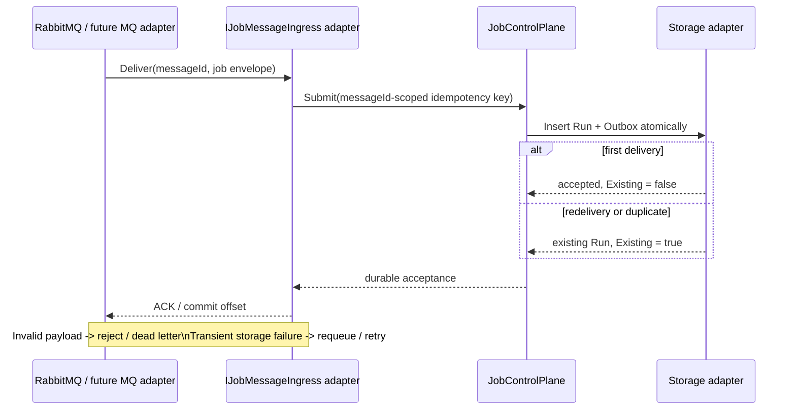
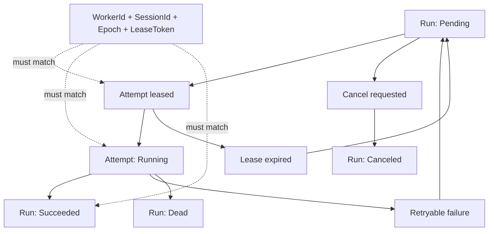
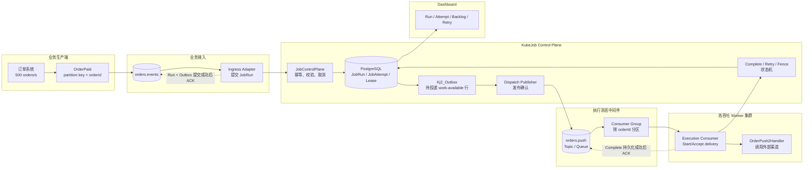
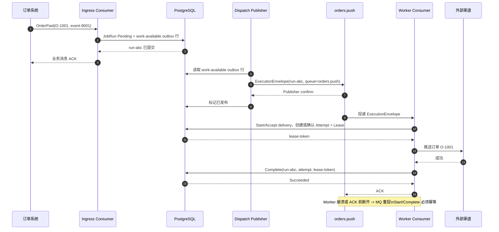

# KubeJob Logical Architecture

This document describes the runtime as a set of deep modules and adapters.
The durable state machine lives behind the control-plane interfaces; HTTP,
typed clients, Dashboard actions, in-process execution, and message brokers
are adapters at those seams.

## 0. Concrete example: `订单推送2`

Imagine an order system publishing an `OrderPaid` event. The business meaning
is “push this order to the external channel”; KubeJob's job type is
`order-push-2`.



这条链路中，订单系统只负责发布业务事件；消息接入 Adapter 把事件转
换成一次 KubeJob 提交。Worker 不需要直接订阅订单消息，而是向控制面
注册能力并 Pull/Claim `order-push-2` 任务。这样队列匹配、并发、租约、
重试和过期 Worker 防护都集中在控制面。

| 字段 | 订单推送2示例 | 作用 |
| --- | --- | --- |
| Job key | `order-push-2` | 标识执行哪一种 Handler |
| Queue | `orders` | 限制哪些 Worker 可以领取 |
| Message ID | `evt-9001` | 用于消息重复投递幂等 |
| Idempotency key | `orders:evt-9001` | 确保只产生一个 JobRun |
| Concurrency key | `order:O-1001` | 同一订单避免并发推送 |
| JobRun | `run-abc` | 这次订单推送的逻辑任务 |
| JobAttempt | Attempt 1, 2... | 每次实际执行和重试 |



如果达到最大尝试次数，`run-abc` 会进入 `Dead`，Dashboard 可以直接看到
失败原因和每一次 Attempt；如果 Worker 中途宕机，LeaseReaper 会回收
Attempt，之后由其他健康 Worker 重新 Claim。

## 1. Runtime topology



### Ownership rules

| Module or adapter | Owns | Does not own |
| --- | --- | --- |
| `JobControlPlane` | submission validation, idempotency command creation, public run snapshots | HTTP status codes, broker acknowledgements |
| `ScheduleControlPlane` | cron validation, time-zone calculation, schedule lifecycle | timer ownership, HTTP serialization |
| `WorkerControlPlane` | session fencing, claim limits, lease renewal, completion rules | handler execution, broker consumption |
| `IJobMessageIngress` adapter | converting a broker envelope into one durable submission | execution ownership, retry policy outside KubeJob |
| `IWorkAvailableNotifier` adapter | reducing claim latency with a wake-up hint | correctness, durable job state |
| worker runtime | bounded execution, handler invocation, heartbeat and completion calls | global scheduling decisions |
| storage adapter | transactions, locking, durable state and outbox writes | transport protocol and UI rendering |

The control-plane modules are the deep modules. Their interfaces are small
relative to the validation, fencing, retry, and snapshot behavior behind them.
The storage interfaces are the real varying seam: the in-memory and PostgreSQL
adapters make that seam useful in tests and deployments.

## 2. Submit and execute a job



The worker is a pull client. A wake-up signal only asks it to claim sooner;
periodic polling remains the correctness path. A broker message is different:
it is a business submission and is acknowledged only after the durable Run is
accepted.

## 3. Business-message ingress acknowledgement



The adapter never claims a worker slot and never treats broker delivery as
execution completion. The Run remains visible in KubeJob even if a worker is
temporarily unavailable.

## 4. State transitions and fencing



`JobRun` is the logical request and survives retries. `JobAttempt` is one
physical execution. Worker sessions and lease tokens prevent a stale process
from completing work after a restart or lease takeover.

## 5. Deployment choices

### Unified process

```text
ASP.NET host
├── HTTP API + Dashboard adapters
├── KubeJob.ControlPlane
├── in-memory or PostgreSQL storage adapter
├── optional Outbox notifier adapter
└── in-process WorkerRuntimeService
```

The in-process worker uses the same `WorkerControlPlane` as a remote worker;
only the transport adapter changes.

### Distributed deployment

```text
API replicas ───────────────┐
Dashboard operators ────────┼──> Control-plane replicas ───> PostgreSQL
RabbitMQ/Kafka ingress ─────┘                 ▲
                                              │ HTTP pull / renew / complete
Worker replicas ─────────────────────────────┘
```

Multiple control-plane replicas are safe because claiming, fencing, retry, and
schedule occurrence creation are decided by database transactions. A message
broker can accelerate delivery, but it is not the source of truth.

## 6. Why this shape is intentionally not a push dispatcher

The durable state machine and the worker execution engine have different
failure modes. Keeping workers as pull clients gives the control plane one
place to enforce capacity, queue matching, concurrency keys, leases, retries,
and stale-session fencing. Message middleware is therefore an ingress or
wake-up adapter, not a second scheduler hidden inside each broker consumer.

This keeps the external interface small while allowing RabbitMQ, Kafka, NATS,
or another transport to be added as independent adapters later.

## 7. High-throughput execution dispatch mode

This mode is now the default execution delivery profile
(`QueueDeliveryOptions.Defaults.Profile = ExecutionDeliveryProfile.BrokerDispatch`,
see [ADR 014](../adr/014-promote-brokerdispatch-to-default-delivery-profile.md)).
Unlike the notification-assisted pull mode,
the execution broker — not a Worker claim scan — delivers the work envelope to
a Consumer Group. It remains a per-queue delivery profile
(`ExecutionDeliveryProfile.BrokerDispatch`) that an operator can pin back to
`Pull` for any individual queue via a per-queue `QueueDefinition`; the control plane still
owns the durable state machine and PostgreSQL remains the authoritative
ledger.



### `订单推送2` 的一次执行



### 这个模式与当前 Pull 模式的差异

| 事项 | 当前 Pull 模式 | 高吞吐 Dispatch 模式 |
| --- | --- | --- |
| 任务来源 | Worker 向控制面 Claim | Worker Consumer 从 MQ 收取 |
| 数据库 Claim | 按队列扫描、`SKIP LOCKED` | 按 RunId 接受消息（targeted admission），避免空轮询和大范围扫描 |
| MQ 消息内容 | 只有唤醒提示 | 执行信封（`RunId`/`Queue`/`EventId`，不含 Payload）；worker 凭 `RunId` 向控制面 admission 取 payload |
| 任务状态 | PostgreSQL | 仍由 PostgreSQL 保存 |
| Worker ACK | 唤醒后即可 ACK | Complete 成功后才能 ACK |
| 重试主责 | KubeJob Attempt/Lease | KubeJob `MaxAttempts` 权威；broker `x-delivery-limit` 仅作兜底，触限后进 DLQ |
| 顺序保证 | `ConcurrencyKey` + 数据库锁 | RabbitMQ 用 logical queue 作 routing key，由 `ConcurrencyKey` + 数据库 fencing 保序；Kafka 适配器未来可按 `orderId` 分区 |
| 当前代码状态 | 已实现（默认 profile，可按队列 `QueueDefinition` 覆盖回退） | 已实现（默认 profile；`BrokerCancelPropagationEnabled` 默认 `true`，只 gate broker 取消传播） |

`WorkerRuntimeService.ClaimLoopAsync` 无论 profile 都持续运行，作为 broker 不可用时的存活兜底（见 [ADR 007](../adr/007-mq-notifications-do-not-own-jobs.md)）。`BrokerDispatch` 成为默认后，该轮询在稳态下只是兜底而非主投递路径；纯 `BrokerDispatch` 工作负载的部署应调高 `KubeJobWorkerOptions.EmptyPollDelay`（默认 1s）以降低稳态空轮询频率。

This mode still provides at-least-once execution. An external order channel
must accept an application idempotency key such as `orderId`; neither a broker
ACK nor a PostgreSQL completion transaction can undo a side effect that
already succeeded before a worker crash.

The broker should absorb bursts, while PostgreSQL remains the authoritative
ledger. If PostgreSQL is unavailable, the dispatcher stops advancing its Outbox
and consumers must delay or retry instead of acknowledging messages.

### Direct Dispatch 拓扑与约定

- **Quorum queue 必选。** Direct Dispatch 消费队列以 `x-queue-type=quorum` 声明，broker 持久化 `x-delivery-count`，跨 worker 重启不丢。`x-delivery-limit` 默认关闭；只有部署同时提供 Pending Run 的 DLQ re-drive/reconciliation 时才应显式启用。`RabbitMqTopologyProvisioner`（IHostedService）在 worker 启动时声明队列与 DLX，`RabbitMqExecutionConsumerService` 只做 passive 声明确认队列存在后消费，避免与 quorum 声明冲突。
- **命名约定。** 调度 group exchange `kubejob.execution.{group}`、按业务 logical queue 的调度队列 `kubejob.execution.{group}.{logical-queue}.queue`、group 共享 retry queue `kubejob.execution.{group}.retry.queue`、调度 DLX `kubejob.execution.{group}.dlx`、调度 DLQ `kubejob.execution.{group}.dlq.queue`、取消 fanout exchange `kubejob.execution.{group}.cancel`、每个 Worker 的取消队列 `kubejob.execution.{group}.cancel.{worker-id}`（名字来自稳定 WorkerId，auto-delete，重启复用同名队列、不产生新队列名；Worker 断开后自动删除，不会累积）。前缀 `kubejob.execution` 来自 `RabbitMqExecutionOptions.ConsumerQueuePrefix`（可配），`{group}` 来自 `ConsumerGroup`。每个业务 logical queue 只对应一条可直接识别的物理 dispatch queue，不附加 hash；retry/DLQ 是 group 级技术队列。物理队列名全部稳定可预期，只有取消队列是临时的。
- **Header 约定。** Dispatch envelope 携带 `properties.Type = "execution-envelope"`、`MessageId = EventId`；cancel marker 携带 `properties.Type = "cancel"` 与 `X-KubeJob-Event-Type = "cancel"`，consumer 不用解析 body 即可按 header 分发。
- **投递路径.** `RabbitMqTopologyProvisioner`（IHostedService）启动时声明 quorum 队列 + TTL retry exchange/queue + DLX + 可选 `x-delivery-limit` + 绑定，`RabbitMqExecutionDispatcher` 发布到 group exchange，`RabbitMqExecutionConsumerService` 只对消费队列做 passive 声明确认存在后消费（拓扑不匹配时 fail-fast，而不是 406 无限重连）。每次提交都会写 `work-available` outbox 行；`Pull` profile 发布为 `IWorkAvailableNotifier` 提示（默认 no-op，worker 仍周期性轮询控制面），`BrokerDispatch` profile 则由 `OutboxPublisherService` 转成 `ExecutionEnvelope` 后投递到选定 transport。
- **批量 admission。** 消费者把最多 `AdmissionBatchSize`（默认 16）个信封收集成一批，用一次 `AdmitBatchAsync` claim 事务完成 admission（每批约 2 次数据库往返：一次 claim、一次未 claim 信封的批量诊断），单信封的 ACK/Reject/Retry 语义不变，容量/围栏/排序 gate 仍按 Run 逐一判定。`PrefetchCount` 应不小于 `AdmissionBatchSize` 以保证批次能装满。
- **Opt-in 开关。** `JobRuntimeOptions.BrokerCancelPropagationEnabled` 默认 `true`（随 `BrokerDispatch` 成为默认 profile 一并调整，见 [ADR 014](../adr/014-promote-brokerdispatch-to-default-delivery-profile.md)），只 gate 取消传播：开启时取消 `BrokerDispatch` Run 会解析 consumer group 并写 `cancel` outbox 行，由 `ICancelPublisher` fanout；关闭时取消只置 `CancelRequested`，靠 lease reaper 兜底。未注册 RabbitMQ execution dispatcher 扩展（即无 `ICancelPublisher`）且仍使用 `BrokerDispatch` 的部署应显式将其设回 `false`。投递本身由队列 profile（`BrokerDispatch`）决定，与该 flag 无关。
