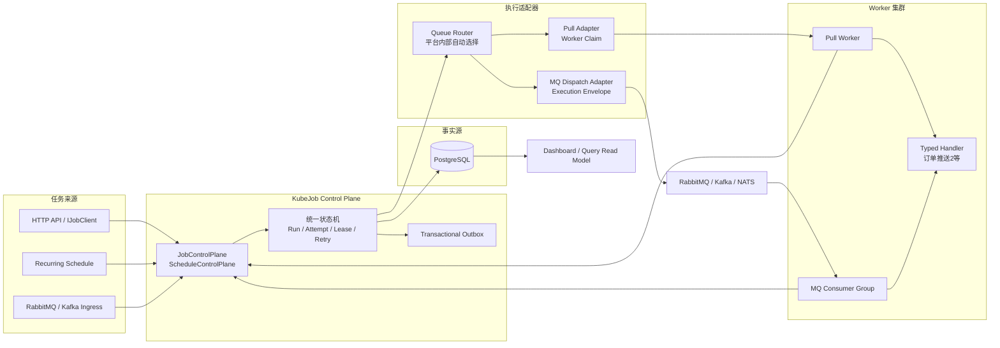

# KubeJob 目标架构

## 一句话方案

KubeJob 最终收敛为：

```text
一个控制面状态机
+ 一个 PostgreSQL 事实源
+ 两种执行适配器
+ 多种消息接入适配器
+ 一个统一 Dashboard
```

普通任务可以使用数据库 Pull，高吞吐任务可以使用 MQ Dispatch；这些都
是平台内部的执行适配器，不能让业务用户在每次提交任务时选择。两者不能
各自维护一套任务状态、重试和租约逻辑。

## 总体架构



## 领域模型

```text
JobKey       = 执行类型，例如 order-push-2
JobRun       = 一次逻辑任务
JobAttempt   = 一次物理执行
Worker       = 稳定的执行节点身份
Session      = Worker 的一次进程生命周期
Lease        = 某个 Session 对某个 Attempt 的临时执行权
Queue        = 对外稳定的逻辑路由和容量池，例如 orders.push
Delivery Profile = 平台内部的 Pull 或 MQ Dispatch 选择
ConcurrencyKey = 业务串行键，例如 order:O-1001
```

必须保持以下不变量：

1. 同一个幂等键最多创建一个 JobRun。
2. 一个 JobRun 同时最多只有一个当前活跃 Attempt。
3. 旧 Session、过期 Lease、错误 Token 不能更新任务状态。
4. Broker ACK 必须晚于持久化接受或完成。
5. KubeJob 保证至少一次执行，不保证外部副作用 exactly-once。

## 用户不选择执行模式

业务用户提交的任务只描述这些内容：

```text
JobKey
Payload
逻辑 Queue
Priority
NotBefore
IdempotencyKey
ConcurrencyKey
Retry / Timeout
```

以下内容不应该出现在用户任务参数中：

```text
Pull / Push
RabbitMQ / Kafka / NATS
Consumer Group
Partition
Delivery Profile
Worker 节点
Lease 参数
```

`orders.push` 是逻辑队列，不代表 RabbitMQ 队列，也不代表 Kafka Topic。
平台内部的 `Queue Router` 根据部署拓扑、积压量、Worker 容量、MQ 健康度
和历史延迟选择 Delivery Profile。

即使系统暂时需要固定某个队列走 MQ，也应该配置在平台部署策略中，不能
让订单服务在提交每一条订单时选择。

## 普通任务模式

```text
Worker -> Claim -> PostgreSQL 锁定 Run -> 创建 Attempt + Lease
      -> 执行 Handler -> Complete -> PostgreSQL
```

适合：

- 定时任务
- 普通后台任务
- 任务量中等但需要强审计
- 需要精确控制取消、重试和并发 Key 的场景

## 高吞吐 MQ 模式

```text
订单系统
  -> MQ Ingress
  -> JobControlPlane
  -> PostgreSQL: JobRun + DispatchOutbox
  -> Dispatch Publisher
  -> MQ Execution Topic / Queue
  -> Worker Consumer Group
  -> Control Plane admission/fencing
  -> OrderPush2Handler
  -> Complete
  -> Broker ACK
```

高吞吐模式的关键不是把 PostgreSQL 完全移除，而是：

- MQ 负责排队、分发和削峰。
- Worker 不再进行大范围 Pending 扫描。
- PostgreSQL 仍记录 Run、Attempt、Lease 和最终结果。
- Worker 执行前必须通过控制面 admission/fencing 检查。
- Complete 成功后才能 ACK MQ。

业务代码看到的始终是同一个 `JobHandle` 和同一个 `JobRun`，不会知道任务
最终经过了数据库 Claim 还是 MQ Consumer。这样以后从 Pull 迁移到 MQ，或
从 RabbitMQ 切换到 Kafka，不需要修改订单服务和 Handler。

### 订单推送2建议

```text
JobKey:          order-push-2
Queue:           orders.push
Partition Key:   orderId
ConcurrencyKey:  order:O-1001
Business Key:    orderId
```

Kafka 使用 `orderId` 作为 Partition Key；RabbitMQ 则需要按订单进行业务
分片或继续使用控制面 fencing。外部渠道必须支持 `orderId` 幂等，否则
Worker 在副作用成功后宕机，消息重投仍然可能造成重复推送。

## 三种消息角色必须分开

| 角色 | 含义 | 是否携带执行权 |
| --- | --- | --- |
| Ingress Message | 外部业务系统请求创建任务 | 否 |
| Wake-up Signal | 提醒 Pull Worker 可能有任务 | 否 |
| Execution Envelope | 高吞吐模式下把任务送到 Consumer | 只有通过 admission/fencing 后才可执行 |

不能把 Wake-up Signal 当成 Execution Envelope，也不能让业务 MQ 消费者
直接绕过 JobRun、Attempt 和 Lease。

## 可靠性策略

```text
Ingress：Run + Ingress Idempotency
Dispatch：Outbox + Publisher Confirm
Execution：Admission + Lease/Fencing
Completion：先写库，后 ACK
Retry：明确由 KubeJob 或 MQ 主导，不能双重重试
Side Effect：业务幂等键 / 应用 Outbox
```

## 迁移顺序

### 第一阶段：先修当前 Pull 基础设施

- Outbox 增加 ClaimToken，防止过期 Publisher 覆盖新状态。
- Outbox Published/Failed 批量更新。
- RabbitMQ 数据库失败使用延迟重试，避免 Requeue 风暴。
- Dashboard 统计从全表扫描改为聚合读模型。
- JobRun、Attempt、Outbox 增加归档和保留策略。

### 第二阶段：抽象执行分发接口

已落地一个深模块接口，业务控制面只知道“投递执行信封”，不依赖具体
RabbitMQ 或 Kafka；业务提交接口也没有增加执行模式字段：

```text
IExecutionDispatcher.DispatchAsync(ExecutionEnvelope)
```

内部由 `IQueueRouter` 根据部署级策略决定调用哪个 Adapter：

```text
logical Queue: orders.push
        ↓
QueueRouter / Delivery Profile
        ├── PullExecutionAdapter
        └── BrokerExecutionAdapter
```

当前默认策略仍是 `Pull`。平台可以在服务启动配置中把某个逻辑 Queue
映射到 `BrokerDispatch`，但这个配置不进入 `EnqueueJobRequest`，业务方不能
按单次 Run 覆盖。Outbox Publisher 会根据路由把消息交给唤醒通知器或
`IExecutionDispatcher`；如果 Broker Dispatcher 没有注册，发布会失败并由
Outbox 重试，不会静默丢任务。

当前已实现平台路由和 RabbitMQ 的 Execution Envelope 发布 Adapter：

```text
Pull：IWorkAvailableNotifier
RabbitMQ：RabbitMqExecutionDispatcher
```

Worker 侧已经支持按 Execution Envelope 携带的 `RunId` 做定向 Admission，
避免收到一条 MQ 消息后误领其他任务。RabbitMQ Consumer 已接入同一个
WorkerRuntimeService，复用 Handler、Lease 续租和 Complete；只有 Complete
成功或明确终态后才 ACK，暂时不可抢占则重新入队。Kafka Adapter 仍可按同一
个 seam 接入。

### 第三阶段：先给一个队列启用 MQ Dispatch

建议先用 `orders.push` 做灰度：

- 其他队列继续 Pull。
- 订单推送队列使用 MQ Consumer Group。
- 对比 Claim 延迟、Complete 延迟、数据库锁等待和 MQ backlog。
- 验证重复消息、Worker 崩溃、数据库故障、外部接口超时。

### 第四阶段：按指标扩容

只有当 PostgreSQL Claim 扫描成为瓶颈时，才扩大 MQ Dispatch 的使用范围。
MQ 会降低扫描和空轮询，但不会自动消除 Run、Attempt、Lease、Complete
等数据库状态写入。

## 最终判断

最佳方案不是“PostgreSQL 或 MQ 二选一”，而是：

```text
PostgreSQL = 任务事实源和一致性控制面
MQ         = 高吞吐任务的排队和分发平面
Worker     = 可横向扩展的执行平面
Dashboard  = 统一的运营观察平面
```

这样可以让普通任务保持简单和可靠，同时让 `订单推送2` 这类高吞吐
任务拥有独立的 MQ 扩展能力，而不会把整个 KubeJob 变成某一种消息中间件
的附属品。
